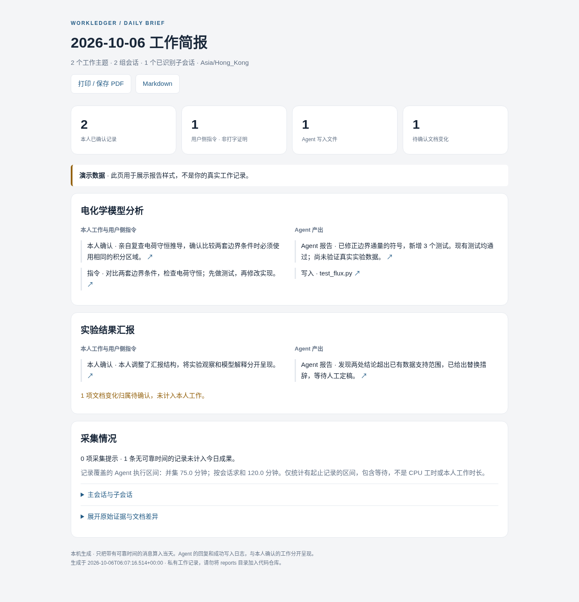

# WorkLedger

**适合 Mac 的本机工作简报工具。把本人工作、Agent 产出、文档变化和 AI 网页聊天分开记录，每天生成一份能快速读完的报告。**

版本：0.1.0 · MIT · Python 3.11+ · 默认没有云端服务、外部模型或运行时 Python 依赖。



## 开始使用

解压后双击 **Install.command**。也可在项目目录运行：

```bash
bash scripts/install.sh
```

安装器使用已有的 Python，复制程序到 `~/Library/Application Support/WorkLedger/app`，注册 macOS 登录后台服务，并打开本机控制面板。它不要求 sudo，不修改 Agent 的源日志，不自动安装大模型。

首次打开面板，添加需要监测的项目文件夹，检查 Agent 日志路径，选择自动报告时间。**自动日报默认关闭，后台采集默认开启。** 文件首次扫描建立基线，之后才比较内容变化。

日常使用有两个 Finder 入口，在 `~/Applications/WorkLedger/`：**打开控制面板.command** 和 **生成今日简报.command**。手动命令：

```bash
~/.local/bin/workledger report --open
```

生成后会打开当天的 HTML 报告和对应 Finder 文件夹。同目录同时保存 Markdown、JSON。自动生成的开关、时间、工作日限制、自动打开选项都可在面板设置。Mac 睡眠期间不能采集；恢复后根据已有数据补生成最多三天的漏报，不推测睡眠期间做了什么。

没有合适的 Python 时，可指定已有 Conda 环境：

```bash
WORKLEDGER_PYTHON="/实际路径/python3" bash scripts/install.sh
```

## 报告长什么样

按项目展示本人已确认的工作、当天用户侧指令、每个主任务的简短 Agent 结果及少量写入文件。只展示当天新消息，不把刚打开的旧聊天算成今天完成的工作。完整会话树、原始证据、文档差异均折叠在下面。

`examples/report.html` 是带有明确标记的虚构演示，不包含真实工作数据。默认规则摘要即可使用；需要更自然的综合总结时，可在设置中启用本机 Ollama，或明确启用远程 OpenAI 兼容接口。

## 当前支持范围

| 来源 | 已实现的读取方式 | 需要在本机确认的部分 |
|---|---|---|
| Codex | 本地 rollout JSONL；用户消息、结果、工具写入、显式子线程和部分执行区间 | 实际 `CODEX_HOME`、版本字段、桌面端是否把这些记录持久化到同一位置 |
| Claude Code | projects JSONL、subagents 子目录；可选 SubagentStart/Stop、PostToolUse hooks | transcript 版本；更深层派生若源日志没写父 ID，不能凭路径推断 |
| OpenCode | `opencode.db` 只读读取，包括 WAL；也支持 `opencode export` JSON | 本机数据库 schema，迁移过的旧版本可改用导出 |
| Pi | session JSONL v1–v3、消息树、工具结果、fork 关系 | 第三方 subagent 扩展的真实父子 ID；fork 不自动当作派生 |
| dsh / DeepSeek Harness | v2/v3/v4 逐事件 JSONL，过滤继承前缀；可选 Zstd 解压 | 本机持久化目录、实际格式和写入插件；v0/v1 打包格式不盲读 |
| ChatGPT、Claude、Gemini 网页 | 配套 Chromium 扩展，在真实发送动作后捕获新出现的消息 | 当前网页选择器和流式界面，必须在真实站点验收 |
| ChatGPT 历史 | 官方 `conversations.json` 按消息 `create_time` 导入、当前分支过滤 | 需从本机已有导出文件手动导入；不是自动读取整个账户 |
| 文档与代码 | 项目目录快照差异；文本、Notebook 源码、Word 段落、PPT 页、Excel 单元格/公式、Office 图片/图表指纹 | 修订视图、复杂形状、嵌入对象和特殊 Office 布局不做完整渲染比对 |
| VS Code | 可选扩展记录编辑器保存差异 | 不能把 `onDidChangeTextDocument` 当作物理键盘输入证明 |

**归属原则：** Agent 成功写入记录归为 Agent。普通文件变化归为待确认；在面板批量确认后，才列入本人工作。源日志中的 `user` 角色只叫用户侧指令，不自动宣称是本人打字。脚本、自动格式化、Copilot 与手动输入可能共同修改一个文件，没有证据时不会强行分配。

## 安装可选采集组件

**AI 网页聊天。** 在 Chrome / Edge / Brave 的扩展管理页面开启开发者模式，选择“加载已解压的扩展程序”，加载 `extensions/browser/`。点击扩展图标，填入 `workledger pair` 显示的本机地址和配对码。配对码不要贴到聊天页。Safari 扩展转换和签名尚未提供。

浏览器首次看到的历史消息不发送为今日消息。网页改版、语音提交、附件独立提交、编辑旧问题、重新生成等路径可能不被实时扩展覆盖；源时间准确的历史补录使用：

```bash
~/.local/bin/workledger import /实际路径/conversations.json --format chatgpt
```

**VS Code。** `bash scripts/install-vscode.sh`，重启 VS Code，然后在设置中启用 `workledger.enabled`。只采集已配置项目内的保存变化，默认禁用。该扩展仍将作者标为待确认。

**Claude hooks。** 本机运行以下命令先查看片段，确认后使用 `--apply` 合并。已有 hooks 保留，设置文件先备份。

```bash
python3 scripts/configure-claude-hooks.py
python3 scripts/configure-claude-hooks.py --apply
```

**dsh 压缩日志。** 使用运行 WorkLedger 的同一个 Python 安装可选解码器：

```bash
python3 -m pip install 'zstandard>=0.22,<1'
```

然后将实际 session 根目录或 `session.v3.jsonl.zstd` 文件路径填入 dsh 来源设置。缺少解码器会显示采集提示，不会伪装成正常采集。

## 检查、开发与发布

```bash
python3 -m workledger --home /tmp/workledger-test doctor
python3 -m unittest discover -s tests -v
node --test tests/*.test.js
```

测试使用合成数据；实际采集范围取决于各 Agent 的日志版本与本机配置。参见 [测试记录](docs/TEST_REPORT.md) 与 [公开发布及 CI](docs/PUBLIC_RELEASE.md)。

发布到你自己的 GitHub 账号：

```bash
bash scripts/publish-github.sh
# 可选：明确指定目标账号和新仓库名
WORKLEDGER_GITHUB_OWNER=YOUR_GITHUB_ACCOUNT WORKLEDGER_GITHUB_REPO=workledger-macos bash scripts/publish-github.sh
```

脚本从当前 `gh` 登录识别账号，创建私有仓库，只发布源码白名单。已有同名仓库时停止，不覆盖远端。公开前应自行检查源码、演示数据和 Git 历史；本机日志、设置、token、报告和数据库不参与发布。

## 文档

[本地 Codex 交接与验收](docs/LOCAL_CODEX_HANDOFF.md) · [架构与数据语义](docs/ARCHITECTURE.md) · [五类 Agent 适配细节](docs/ADAPTERS.md) · [浏览器适配](docs/BROWSER.md) · [来源资料](docs/SOURCES.md) · [测试记录](docs/TEST_REPORT.md)

卸载后台服务与命令入口可运行 `bash scripts/uninstall.sh`。它保留个人记录，不会删除数据目录。
